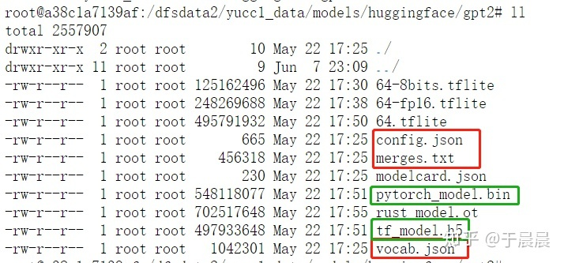

## Requirements

| Tools / Packages | Version | Installation                                                 |
| ---------------- | ------- | ------------------------------------------------------------ |
| Python           | 3.6     | [Miniconda (conda 4.9.2 recommended)](https://docs.conda.io/en/latest/miniconda.html) |
| pytorch          | 1.7.1   | [Pytorch (GPU version recommended)](https://pytorch.org/get-started/locally/) |
| transformers     | 4.8.2   | [Huggingface Transformers (pip install recommended)](https://huggingface.co/transformers/installation.html) |
| matplotlib       | 3.3.4   | for visualization                                            |
| sklearn          | 0.22    | for classic  ML models                                       |

* Make sure your pytorch version matches the CUDA version of your machine for the program to run on GPU.

* Due to the blocking of GFW and the blocking of Hugging Face, you may currently be unable to automatically download the required BERT models from Hugging Face. Please consider downloading them manually and importing them into your system.

* The method to manually download the BERT model is as follows: Go to the [huggingface.co/models](https://huggingface.co/models) website and manually download the desired model. Save it locally. Then, run bertclf-train-local.py, making sure to use the '`local_path`' parameter to specify the location where the model is saved. In the downloaded file, the red-highlighted parts are required, while the green-highlighted parts are optional and can be selected between the two options.

  

  

## Dataset

For Bert Models,[4 Universities Data Set](http://www.cs.cmu.edu/afs/cs.cmu.edu/project/theo-20/www/data/) from [WebKB](https://www.cs.cmu.edu/~webkb/) is used for fine-tuning.

The full texts of the web pages are pre-processed by removing all the noninformative texts including HTML elements, front matters and punctuations.

For classic machine learning models,the datasets are downloaded from  [Ana Cardoso Cachopo's Homepage](https://ana.cachopo.org/datasets-for-single-label-text-categorization).

## Start-up

The example commands for starting the training directly is in example_commands.txt. 

There are two main commands, one for running bertclf-train.py and the other for running bertclf-train-change-others.py. These two scripts are used to perform data splitting on the entire dataset and to use data from a specific school as the test set, respectively. The latter one is designed to explore the significant differences between the web page texts of one school and the other schools.

Several hyperparameters and settings are required including:

| Parameters      | Type    | Description                                                | Default                        |
| --------------- | ------- | ---------------------------------------------------------- | ------------------------------ |
| `--bert_name`   | string  | BERT name for classifier                                   | `bert-base-uncased`            |
| `--max_len`     | integer | max length of tokenization                                 | `256`                          |
| `--batch_siz`   | integer | batch size                                                 | `16`                           |
| `--lr`          | float   | initial learning rate                                      | `5e-6`                         |
| `--num_epoch`   | integer | max number of epochs                                       | `100`                          |
| `--random_seed` | integer | global random seed                                         | `2023`                         |
| `--uni_lt`      | strings | list of university names                                   | all the five university labels |
| `--test_dt`     | strings | list of university names that be designated as the testset | -                              |
| `--local_path`  | strings | Local model save path                                      | .                              |

`--bert_name` is for the `BertModel.from_pretrained()` from transformers package, which can be `bert-base-uncased` (by default) `,bert-base-cased`,or `prajjwal1/bert-tiny`for BERT mini and  `prajjwal1/bert-mini` for BERT Tiny.

In classical machine learning models, the following hyperparameters are involved in the search:

| Hyperparameters     | Models                        | Description                                                  | Default         |
| ------------------- | ----------------------------- | ------------------------------------------------------------ | --------------- |
| `n_estimators`      | `random forest`               | specifies the number of decision trees to be created in the forest. Increasing the number of estimators can lead to better performance, but it also increases the computational cost.` | `100`           |
| `criterion`         | `random forest,decision tree` | it specifies the function used to measure the quality of a split at each tree node. | `gini`          |
| `max_depth`         | `random forest,decision tree` | It controls the maximum depth of each decision tree in the forest. Deeper trees can capture more complex relationships in the data, but they are also more prone to overfitting. | `None`          |
| `min_samples_leaf`  | `random forest,decision tree` | It sets the minimum number of samples required to be at a leaf node. If a split results in a leaf node with fewer samples than this threshold, the split is not allowed. | `2`             |
| `min_samples_split` | `random forest,decision tree` | It sets the minimum number of samples required to split an internal node. If the number of samples at a node is below this threshold, the node will not be split further. | `1`             |
| `max_features`      | `random forest,decision tree` | It determines the maximum number of features to consider when looking for the best split at each tree node. | `auto(sqrt)`    |
| `penalty`           | `linerSVC`                    | The penalty parameter specifies the type of regularization penalty to be applied. LinearSVC supports two penalties: 'l1' and 'l2'. 'l1' penalty promotes sparsity by encouraging some feature weights to be exactly zero, while 'l2' penalty encourages small weights by adding a squared magnitude term to the loss function. | `l2`            |
| `loss`              | `linerSVC`                    | The loss parameter determines the loss function to be optimized. LinearSVC supports two loss functions: 'hinge' and 'squared_hinge'. The 'hinge' loss is the standard loss for support vector machines, while the 'squared_hinge' loss is a smoother variant that penalizes outliers more gradually. | `squared_hinge` |
| `C`                 | `linerSVC`                    | C is the regularization parameter that controls the trade-off between maximizing the margin and minimizing the training error. A smaller value of C allows for a wider margin but may lead to more misclassifications, while a larger value of C enforces stricter margins and aims to reduce misclassifications. | `1`             |

## Code Structure

#### For the BERT classification:

* The model `BertClassifier` (BERT+Linear) and functions `train_loop` and `test_loop` for training and evaluation respectively are defined in bertclf.py .
* The training and evaluating scripts are in the same file named bertclf-train.py since the whole task is simple.The dataset splitting statistics, fine-tuned model and the visualization figures will be saved after training.
* You can use bertclf-train-change-others.py to switch which universities' data is excluded from the training set and used only as the test set, in order to explore which category of universities exhibits the greatest differences in text compared to other schools.
* Some helpful tool functions are defined in several files in utils directory, including dataloader.py  module and vis.py module for data loading and visualization respectively.
* dataset.tsv is the pre-processed dataset that can directly loaded for training. 
  The function of data cleaning for the original dataset is in utils/preprocessor.py, with which you can customize your data cleaning by modifying the pre-processing functions in it. Make sure you've unzip the `webkb` of the original dataset to the root directory of the project for the pre-processing function.

#### For the classic ML models classification:

- Random Forest, LinearSVC, and Decision Tree algorithms were used as the foundational algorithms for classification. The script using these algorithms for classification is stored in main_search.py.
- Five-fold cross-validation and grid search were used to optimize the hyperparameters of the relevant models. The specific script for hyperparameter tuning is named 'main_search_XXX.py'.`Weighted_F1_score` was used as the metric for model optimization.
- TF-IDF was used as the tool for vectorizing words. Additionally, the vectorized word texts are saved in idf_weights.txt file.
- The model does not have a set `random_state`. It will run for a specified number of `ITERATIONS`, and the results of multiple estimations of the model will be subjected to t-test and p-test. The corresponding classification report, accuracy, t-test, and p-test results will be printed in the terminal. The confusion matrix will be saved in the /pic directory.

## Results

Four-category classification (*student*, *faculty*, *course* and *project*) is conducted on the whole dataset, i.e. with samples from all five university labels including `misc`. Class *staff* and *department* are removed because of imbalance. 

| Model                            | n_epoch               | Accuracy (%)     |
| -------------------------------- | --------------------- | ---------------- |
| BERT-Base-uncase                 | 10                    | 96.0             |
| BERT-Base-cased                  | 10                    | 96.7             |
| BERT-Tiny                        | 100                   | 95.4             |
| BERT-MINI                        | 100                   | 96.7             |
| BERT-Base-uncase-conell-test     | 10                    | 95.3             |
| BERT-Base-uncase-misc-test       | 10                    | 92.1             |
| BERT-Base-uncase-texas-test      | 10                    | 97.7             |
| BERT-Base-uncase-Washington-test | 10                    | 92.6             |
| BERT-Base-uncase-Wisconsin-test  | 10                    | 96.2             |
| **Model**                        | **F1-score-weighted** | **Accuracy (%)** |
| linear-SVC                       | 0.90                  | 90               |
| randomforest                     | 0.89                  | 89               |
| decisiontree                     | 0.66                  | 65               |

- The classification accuracy of the BERT model using deep learning is significantly higher than that of classical machine learning models.
- Among the BERT models, bert-base-cased performs the best, while among the classical machine learning models, LinearSVC shows outstanding performance.
- In the original webkb text, the "misc" class of schools may exhibit the greatest differences compared to other schools' text, which aligns with our intuitive understanding.
